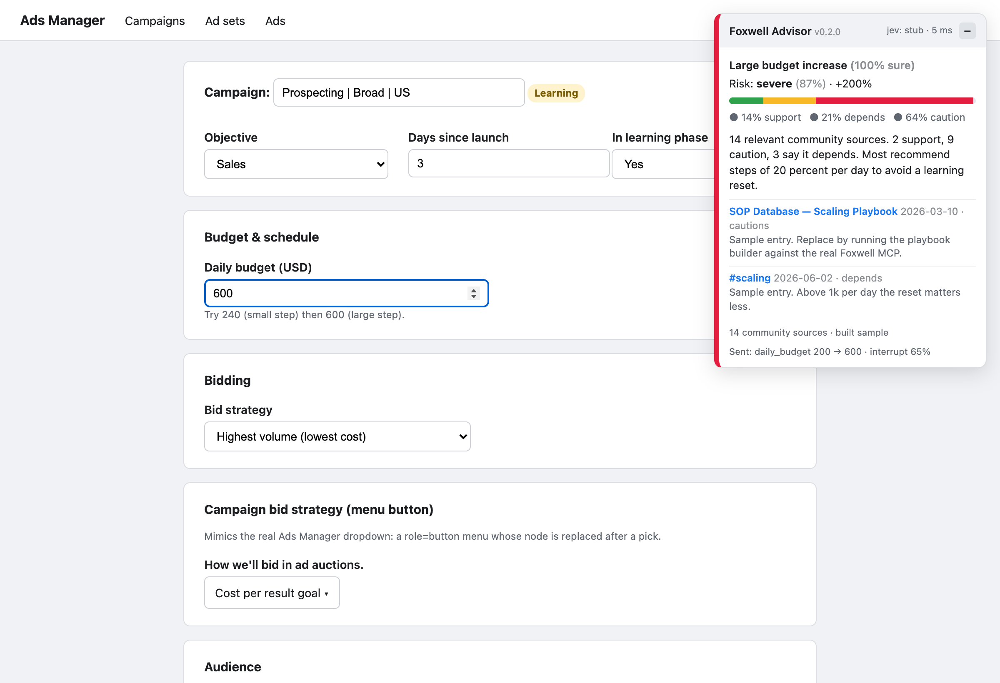

# Foxwell Advisor

Real-time, community-backed advice while you edit Meta Ads Manager.

- **Foxwell MCP** supplies the evidence: Slack threads, podcast transcripts, SOPs. Get access at [foxwelldigital.com/mcp](https://www.foxwelldigital.com/mcp).
- **TypeSafe Jev** makes the fast typed decision: which change is this, how risky, worth interrupting.
- A **Chrome extension** shows the verdict in a docked panel before you click Publish.

Nothing leaves your machine except one small change event to `localhost:8877`, one Jev call, and the nightly playbook searches against the Foxwell MCP.

## How it works

```
nightly   playbook_build.py  ──MCP search per topic──▶ Foxwell
                             ──Jev stance per chunk──▶ TypeSafe
                             ──▶ data/playbook.json

live      Ads Manager field ──change event──▶ server.py ──one Jev call──▶ TypeSafe
                                                        ◀── topic + risk + interrupt
                                              playbook lookup ──▶ panel (~100-300 ms)
```

The live path never searches Foxwell. Jev classifies the change into one of the playbook topics and the server returns the cached community verdict for that topic.

## Setup

```bash
python3 -m venv .venv && .venv/bin/pip install -r requirements.txt
cp .env.example .env    # add FOXWELL_MCP_TOKEN (sign up at https://www.foxwelldigital.com/mcp) and TYPESAFE_API_KEY (https://console.typesafe.ai)
```

Without `TYPESAFE_API_KEY` the Jev client runs in **stub mode**: deterministic keyword-overlap answers, labelled `"stub": true`. The demo runs end to end in stub mode using `data/playbook.sample.json`.

## Run the demo

```bash
.venv/bin/uvicorn advisor.server:app --port 8877
open http://localhost:8877/mock/
```

The mock Ads Manager page loads the extension script inline, so no extension install is needed for the stage demo. `http://localhost:8877/mock/?budget=600` fills the budget on load, handy for screenshots and rehearsal. Change the daily budget from 200 to 240, then to 600. Switch the bid strategy. Untick the status while "In learning phase" is Yes.

## Demo on the real Ads Manager

1. Start the server (above). Keep `.env` filled so Jev is live.
2. Open `chrome://extensions`, turn on Developer mode, click "Load unpacked", pick the `extension/` folder.
3. Open Ads Manager in that Chrome profile. The panel appears top right and says "Waiting for a change."
4. Open an ad set you do not mind touching (a paused test ad set on your own account is ideal). Click into Daily budget, type a new value, tab out. The panel reacts. Change the bid strategy. Toggle the ad set switch.
5. Do not click Publish. Ads Manager keeps edits as a draft; use "Discard drafts" when the demo is over.
6. The panel header shows the build, e.g. `v0.2.0`. After pulling changes, click the reload icon on `chrome://extensions` and refresh Ads Manager; if the number in the header did not change, Chrome is still running the old build (check that the unpacked folder is this repo's `extension/`, not a copy).
7. Drag the panel by its header to move it off the date picker or the Publish bar. Click the header or the minus button to collapse it to a pill. It pops open on its own when there is real advice, and it remembers where you put it.

Controls verified live on a real ad account (2026-09-21): daily budget input, budget mode combobox, bid strategy menu button (`role=button` + `aria-haspopup=menu`, label "How we'll bid in ad auctions."), A/B test switch, schedule radios, pixel, event, conversion value, ROAS goal, attribution model.

How field detection works on the real page: there are no hard-coded selectors. The content script watches every editable control, reads the nearest label text (aria-label, `<label>`, heading), and sends that label with the old and new value. Jev classifies the change from the label text, so "Daily budget", "Bid strategy", "Cost per result goal" all route without a selector. If a control produces no useful label, nothing is sent.

Change detection is keyed by label, not by DOM node. Ads Manager re-renders dropdowns as fresh nodes after a pick, so the script rescans on every DOM mutation and once a second and compares each labelled control's value to the last one seen. Some picks (ROAS goal, cost per result goal) open a dialog and only change the dropdown after the dialog is confirmed, so the script also fires on the menu item click itself, attributed to the menu that was opened, and on a dialog that appears right after a menu click. Cancelling the dialog does not fire a second event. Set `localStorage["fx-advisor-debug"]="1"` in the DevTools console to log every bound control and change.

If the panel stays quiet on a field: open DevTools, Console, and check for `fx-advisor` errors; then check the Network tab for the POST to `localhost:8877/advise`. The most common cause is a control rendered inside an iframe, which content scripts do not see unless `all_frames` is set in the manifest.

## Build the playbook

```bash
.venv/bin/python -m advisor.playbook_build --dry-run                     # search only, prints chunk counts
.venv/bin/python -m advisor.playbook_build --topics budget_increase_large,bid_cost_cap
.venv/bin/python -m advisor.playbook_build                               # all topics
.venv/bin/python -m advisor.playbook_build --from-raw                    # re-run Jev on cached searches
```

Raw search results are cached in `data/raw/` so re-classifying does not hit the Foxwell rate limit. The Foxwell MCP allows 10 searches per minute per token; the builder paces itself at one search every 6.5 seconds and waits 65 seconds when it is told to. A full 22 topic build takes about 3 minutes. Topics live in `advisor/topics.py`. Each topic has three Foxwell queries (results are merged and deduplicated) plus a statement Jev tests every chunk against (supports, cautions, depends, unrelated). Jev also tags what each caution or depends chunk hinges on (spend level, account maturity, creative, product or offer, seasonality); the most common one becomes the topic's deciding factor and shows in the panel.

## Performance data and the outcome loop

Jev sees real performance without any API token. The extension reads what is already on the page:

- In the editor, the summary card (amount spent, cost per result, purchases).
- In the table, every visible row: spend, purchases, ROAS, cost per result, frequency, delivery status. Ads Manager renders a virtualized grid, so cells are matched to rows by vertical position and to columns by the header's horizontal span.

Those numbers travel with each change event, so a 2x budget on an ad set with 41 purchases and ROAS 3.4 is judged differently from one still in learning with one purchase.

The same rows are posted as a snapshot on page load and every five minutes (`POST /snapshot`). Seven days after an advised change, `POST /outcomes/judge` compares the nearest snapshot before the change with the first one at least six days after, and asks Jev whether the community advice held (held, contradicted, inconclusive) with a confidence. Advised changes start as `pending`. When the buyer clicks Publish (editor footer, inline popover, or the Review and publish drawer) the extension marks the changes since the last such click `published`; Discard or Cancel marks them `discarded`. Only published changes are judged; discarded ones are closed as `not_applied`; changes whose publish state was never seen stay pending and are reported separately. `GET /outcomes` lists recent events and the running tally. Storage is a local SQLite file, `data/advisor.db`, git-ignored. Only metrics visible in the buyer's own account are stored.

## API

`POST /advise`

```json
{"field": "daily_budget", "old": 200, "new": 600,
 "campaign": {"name": "Prospecting", "in_learning": true, "days_since_launch": 3}}
```

Returns topic, topic confidence, risk level with confidence, interrupt probability, the playbook verdict with sources, the parsed performance the panel saw, the stored event id, and latency plus Jev usage. Pass `entity` (account, level, id, name, date_range, metrics as label to text) to include page performance.

`GET /playbook` the cached playbook without chunk bodies. `GET /health` mode and playbook status.

## Tests

```bash
.venv/bin/python -m pytest -q
```

## Screenshot



## Notes

- The Foxwell MCP `search_foxwell_knowledge` tool returns one formatted string. `advisor/foxwell_client.py` parses it into chunks. If the server ever adds a raw JSON tool, swap the parser.
- Jev request and response shapes follow docs.typesafe.ai/api and were verified live against `jev-1.13.0`. A score answer's `score` is an expected value (float); `probabilities` is keyed by level index with a `legend`. The server reads the most likely level, not the rounded expected value.
- Observed live latency: 130 to 400 ms per call, about 440 input tokens for a change event.
- Ads Manager DOM changes often. Keep the extension read-only and scoped.
